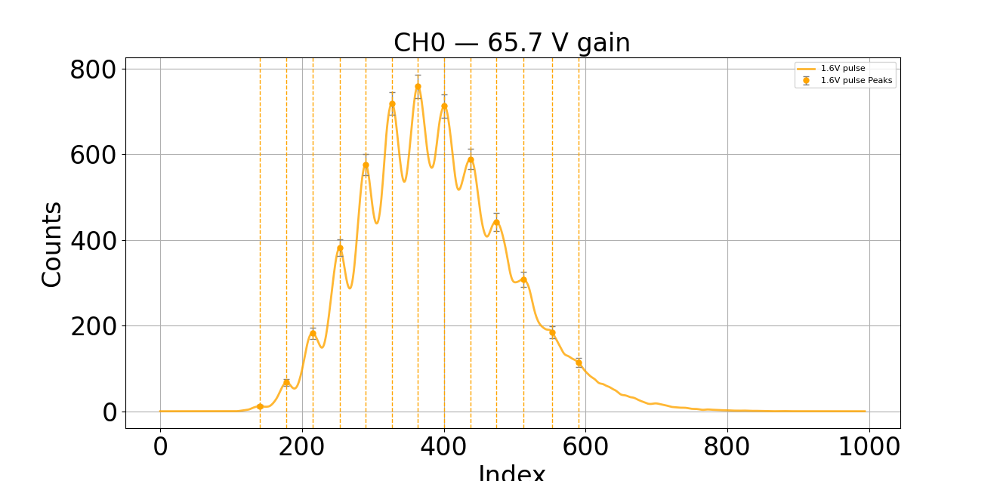
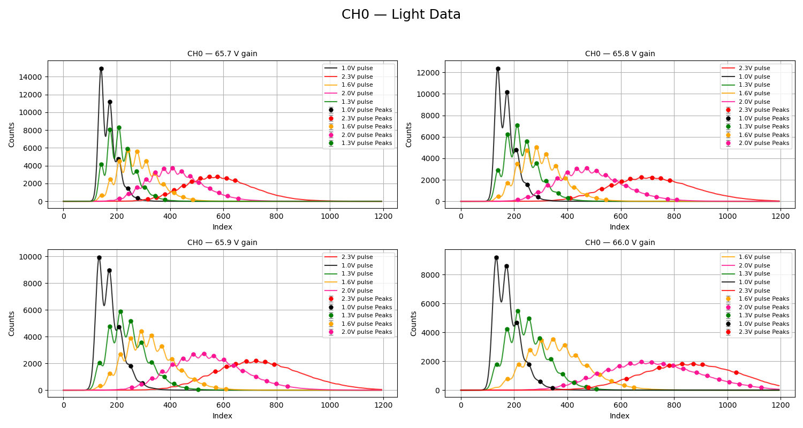
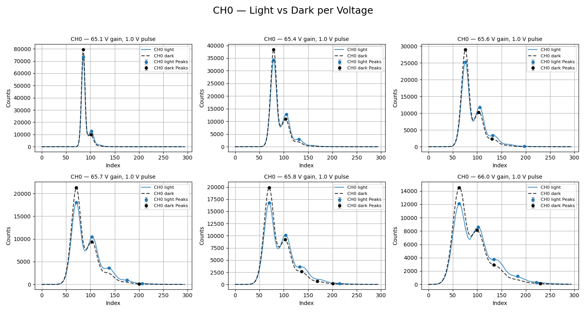
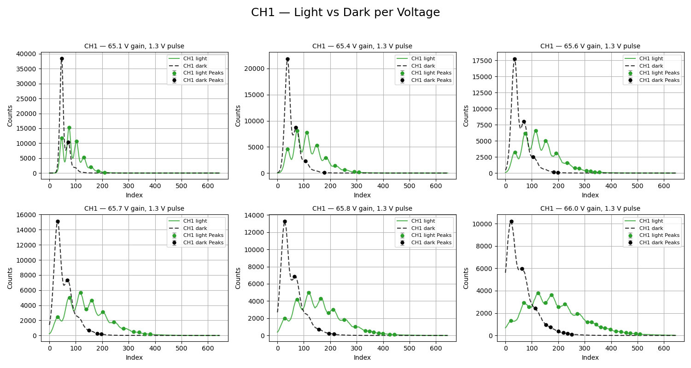
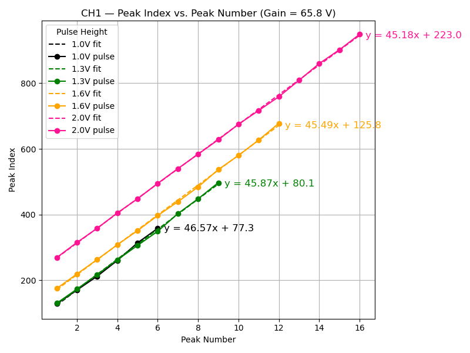
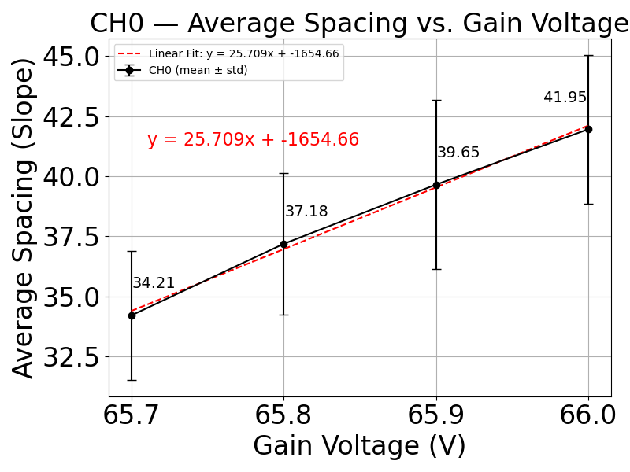
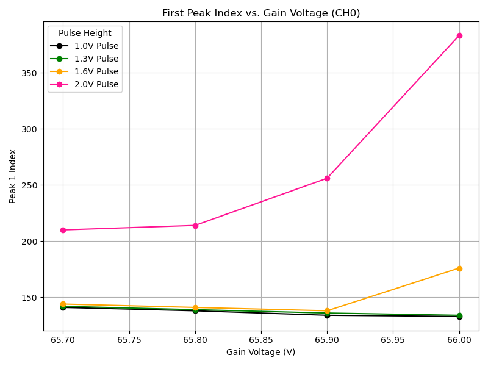

# What's This Project For?

This project analyzes SiPM (Silicon Photomultiplier) photon count data from CoMPASS, a physics data acquisition system. We're looking for:

* Peaks in photon count curves, at different gain and pulse voltages.

* How those peaks shift, how far apart they are, and whether you can correlate signals across channels.

# How It's Organized

There are two main analysis types:

1. Single-Channel Analysis (focuses on one detector)

2. Coincidence Analysis (compares two detectors, looking at correlated events)

#️ What to Run — Step-by-Step

1. Put the data files in photon_counts_data. Clear the folder generated_peak_data_results that gets populated when running the main script for the other analysis scripts (slope, comparison, etc) to have just the most recent data.
 
2. Setup the parameters in the main script

> `plot-fit-peaks-SiPM-data.py`

- **data_dir**: change the name of the name starting with a date in the data directory to look at. All data `data-photon-counts-SiPM/`, you need to specify which day's data you want to analyze
  - e.g `20250505_coic_correlation_time_vary` isa foldername you can change in there to `20250428_more_light`
- **gain_voltages_to_plot** to see only data associated with the desired gain voltages determine the number of plots and which plots are plotting for that specific gain voltage 
  - e.g if my data for example has [65.7,65.8,65.9] in its list, then changing it to [65.7,65.8] plots only data associated with that tag and same for a single [65.7]
    - obviously, this breaks when you choose something that doesnt exist, probably an exception or error will hiw
- **crop_off_start** how many values you want to crop off the start of the data
  - e.g if you want to crop off the first 100 values because the data is shifted to the right, then change it to `crop_off_start=100`
- **crop_off_end** how many values you want to crop off the end of the data
  - e.g if you want to crop off the last 2000 values that have no data in them (produces data up to 40000 and only relevant data is ~1500 in size, then change it to `crop_off_end=2000`
- **vertical_lines** boolean True or False, puts a vertical line where the calculated peaks are, it sometimes makes it easier to read the plot. For example, if turned on then all the plots will look like this:
- 
  - I set only one value of the gain to look at currently and that is its plot
- The next set of parameters determine the fitting of the data (using interpolation of the data to get the curve but will double check)
- **counts_threshold**: threshold of counts that anything below 100 will **not** be considered a peak, easy to change around when you see lower peaks not being found by peak finder
- **peak_spacing_threshold**: threshold of distance between peaks,( e.g prevent multiple points on the same peak), mine is at 16, which means the peaks have to be at least 16 indices away from each other to be considered a peak
- **sigma** this is used to make the data more smooth (is the standard deviation of the gaussian fit, this is used to determine how wide the peak is, if you want to change it to be wider or narrower, you can change this value)
- **pulse_color_map** allows you to change the specific colors of each of the pulse height curves
- **manual_peak_indices** if no matter what you do to try and get all the peaks, some won't be found because they are on a vertical hill or something like that, so you can add in peaks by analyzing the graph and putting in that index so it gets properly counted as a peak

- clear the folder that gets populated when running the main script for the other analysis scripts (slope, comparison, etc) to have just the most recent data in generated_peak_data_results
- csv updates automatically just check the date it was generated if unsure

  1a). **Description**: This python file will plot all the gain voltage subplots associated with the channel. It plots the data, fits and smoothes the data, and generates the data required for further analysis in the 'single-channel-analysis' and other subdirectories.

Run the script.

Results files get generated after each run of the main script. The folder generated_peak_data_results gets populated with the data used for the other analysis scripts (slope, comparison, etc).

3. Run single-channel-analysis/plot_index_vs_peak_slope_spacing_table.py to generate the index vs peak data. This python file will plot the index vs peak data for each channel and save the plots in the folder "index_vs_peak_data_results". It will also save the data in a csv file in the same folder.

4. Run single-channel-analysis/plot_spacing/plot_spacing_between_peaks.py to generate the spacing vs peak data. This python file will plot the spacing vs peak data for each channel and save the plots in the folder "spacing_vs_peak_data_results". It will also save the data in a csv file in the same folder.

* Output:

	* Peak plots (for each channel)

	* CSV files with peak positions (in generated_peak_data_results/)

* What it does:

	* Reads in CoMPASS data

	* Smooths, crops, finds peaks

	* Plots curves and saves peak index data

# Optional: Dark vs Light Comparison

* Use script plot_light_vs_dark_counts_pulse_height_vary_gain_voltage_loop_subdirectory.py

* Needs folders with names like *_dark* and *_pulse_* for comparison

# Data Folder Naming Logic (Important!)

Each folder is named like:

> 65_7_gain_1_1_pulse_300s

The script extracts:

* Gain: 65.7 V

* Pulse Height: 1.1 V

* Duration: 300s

For coincidence measurements:

> peak4_and8_50ns_correlation_window_65_7_gain_1_6_pulse_60s_filtered

Extracts:

* Peaks: 4 (main) and 8 (comparison)

* Correlation window: 50 ns

* Whether it's filtered or raw

* Same info about gain/pulse

# Common Issues

* Don't forget to delete old files in generated_peak_data_results/ before rerunning.

* Wrong folder path = no data found. Make sure data_dir is correct.

* Make sure each run folder inside data-photon-counts-SiPM/ is well-formed (naming conventions matter).

# Script Descriptions 
	
In single-channel-analysis:
	
	* `plot_index_vs_peak_slope_spacing_table.py`

		* Reads peak data from `generated_peak_data_results`/

		* Plots peak index (x-axis) vs. peak number (y-axis)

		* Calculates slope of each curve (i.e., peak spacing trend)

	* `plot_spacing_between_peaks.py`

		* Also uses peak data

		* Shows how the spacing between peaks varies with peak number

		* This helps see if spacing is regular, how it changes with light/gain

	* Each creates:

		* Plots in its own folder (index_vs_peak_data_results/, etc.)

		* CSV files with calculated slopes or spacings
		

# Todo: - make compass folders paraced to look like my folders to be more light weight

# 1. Run the main script
The data structure was choosen to be able to loop through subdirectories in the data folder because in CoMPass, they package a single run into a project to be able to so easily drop the `runs` in a specific **drop CoMPass run folders can be simply dropped into the `data-photon-counts-SiPM` folder. (you need to change the path or take files out of each folde) **
##   Run `plot-fit-peaks-SiPM-data.py` to generate the data used in either the single-channel-analysis or coincidence-analysis subdirectories.  

- - -   
### Parcing meta data  
 
- check that the data is in the correct format to parace information out of them
      - 
      - **WARNING: COMPASS PATH DATA WAS PULLEN OUT DIRECTLY, SO YOU'D HAVE TO CHANGE THE PATH UNTIL I BUILD OUT SOMETHING TO PARCE THINGS OUT OF THOSE** :

- **_WARNING:_** If there are files in `/generated_peak_data_results` from a previous run, delete them before running the script. 
This will ensure that the new data is not mixed with old data.

#### For single channel measurements:  
`Gain-voltage-number-decimal-represents-decimal**_gain_**Pulse-voltage-height-decimal-is-underscore_pulse_Duration-of-the-run_s` contains folders with the data
- - 
- - **_Example_:** in`data-photon-counts-SiPM` there is a folder named `20250428_more_light`
  Therewill be subdirectories inside which contain the `run` data from CoMPass. Currently for me they are:
 - - `65_7_gain_1_1_pulse_300s`
 - - `65_7_gain_1_0_pulse_300s`

- - - This means that I took two runs that day where I was changing the pulse height. The **65_7 gets parced out to be 65.7** because it's **in the back of the word gain** 
  - - The **1_1** in the directory name means I was using a pulse height voltage of **1.1** because it is **in front of the word pulse**
  - - The **300s** means I was running the experiment for **300 seconds**.
    - Some files have a `dark` written on the name, this was used in the dark measurement comparison and that gets paraced out in a very specific script `plot_light_vs_dark_counts_pulse_height_vary_gain_voltage_loop_subdirectory` in other scripts these types of files will not be seen
  - 
#### For Coincidence meassurements: 
`peakNUMBER-OF-PEAK-TO-COMPARE-TO_andNUMBER-OF-SECOND-PEAK-FOR-CORRELATION_correlation_window` the next part is the same file format as the single channel, but it ends with words `filtered`,`unfiltered`, and `raw`

- This means we can extract additional information of the peak numbers, correlation window, and filtered or unfiltered (or raw) to be able to sort all data coming from those folders to be in the same place
- 
  - _**Example:**_ in `data-photon-counts-SiPM` there is a folder named `20250505_coic_correlation_time_vary`and it might have a subdirectory that should look like this:`peak4_and4_50ns_correlation_window_65_7_gain_1_6_pulse_60s_filtered`  
    - `peak4_and8`: parces out to be comparing peak number 4 and correlation with the other detector peak 8
      - `4` peak comparing to
      - `8` peak checking correlation between photons
      - `50ns_correlation_window` is the correlation window I used to count when photons are considered simultaneous, denoted by being in front of those words correlation_window
      - We still get the other information using single channel analsis (voltage gain, pulse height, duration of experiment)
      - at the end of the name is `filtered` or `unfiltered` or `raw` is the type of data we are using. This allows us to make comparisons between filtered and unfiltered data
        - `filtered` means that the data was filtered to remove noise (by ComPass)
        - `unfiltered` means that the data was not filtered (by ComPass)
        - `raw` raw data from CoMPass

    
**Output**: crops, identifies peaks, and fits the curve

It produces an two images (one for CH0 and one for CH1) that looks like this: 

###  Running the dark counts script

In our initial analysis, we wanted to be able to distinguish between the peaks with no light, the "dark", and compare it to different pulse heights. There are peaks with no light because these are thermal photons that are being detected once the instrument turns on. We compared the lowest possible level of light to see how it compared to the dark.

- The initial analysis used 1.0V pulse height and 65.7V gain voltage. The lsb settings on each channel was different from the latest ones now.

- 
 
There is barely any light, but can see it the most when zooming into 65.7V plot above 2nd and 3rd peaks
We also wanted to compare the dark with differnt light levels (higher pulse height) to see the difference.

First with a 1.3V pulse and further with a 1.6V pulse height
- 

This comparison didn't turn out to be that helpful initially, but seeing the curve get cut off at the beginning , putting all those counts in the first bin where they should not be. 
So, we learned how **critical it is to have set the right lsb settings for the channels** in ComPass.

**_HOW TO AVOID:_** I typically move my lsb settings to put the curve way out to the right. There are a total of 4000 ADC channels so there is a lot of wiggle room to put the peaks to never have to think about this issue
 
# 2a.) Single Channel Analysis from generated results by step 1.

For each set of scripts in each analysis folder, some scripts need to run before others because they generate more results for other scripts. So, starting by order

## 1.) `index_vs_peak.py`
#### Reads data from a .csv from `plot-fit-peaks-SiPM-data.py` and outputs data for other scripts (e.g spacing extracted from slopes here)
- **Purpose**: Analyzes the relationship between index and peak values.
- **Description** By analyzing the peak index versus peak number, we are looking fow how the position of the peak (the index) changes with each peak number. A constant slope would mean that each peak moves at the same rate, so increasing the peak number doesnt change the spacing
- **Functionality**:
  - Reads from .csv from `plot-fit-peaks-SiPM-data.py`
  - Generates a plot of index vs peak values.
  - Calculates the mean of the slope of different light levels for each gain voltage
  - Exports calculated slopes data to a CSV file 
It uses the means calculated in `plot_index_vs_peak.py` between all the lines representing different pulse height for each gain and channel. Outputs the mean of the light levels spacing as a function of gain voltage 
  - 
**There are no free parameters for the user to change in this script, those are set by running** `plot-fit-peaks-SiPM-data.py` **and the data this script uses comes from a folder** `generated_peak_data_results` **which is the combined peak data generated by above mentioned main script**

### This generates files that look like this:
And produces a plot for every gain and every channel (turn off interactivity if you dont want to annoying click exit on all of them)
- 

And example of how the gain and channel being changed looks like:
- 
#TODO double check labels 1.3 showing up for both.

 **Description**: This python file will plot the index vs peak data for each channel and save the plots in the folder 'index_vs_peak_data_results'. It will also save the data in a csv file in the same folder.

## 1a.) `plot_spacing_between_peaks.py`
#### Reads data from a .csv from `index_vs_peak.py` and outputs spacing data to plot. 
- **Purpose**: Examines the spacing between peaks and their corresponding values.
- **Functionality**:
  - plots the spacing between peaks using the slopes calculated in `index_vs_peak.py`
  - It uses the means calculated in `plot_index_vs_peak.py` between all the lines representing different pulse height for each gain and channel. Outputs the mean of the light levels spacing as a function of gain voltage 
  - 
- **Usage**: Run this script to study the spacing between peaks in the data, using the method of extracting the mean slopes of light levels from .csv outputted by `index_vs_peak.py` 

This script generates a plot that looks like this:

- 

## `plot_first_peak_position.py`

#### Reads data from a .csv from `index_vs_peak.py` plots the first peak position for each pulse height as a function of gain voltage
- **Purpose**: Plots position of first peak for each pulse height as a function of gain voltage
- **Functionality**:
  - Reads in csv file generated from `plot-fit-peaks-SiPM-data.py` which contains all the first peak position data in a separate .csv
  - Reads in first peak data per pulse height and plots it
  - It uses the means calculated in `plot_index_vs_peak.py` between all the lines representing different pulse height for each gain and channel. Outputs the mean of the light levels spacing as a function of gain voltage
- **Usage**: Run this script to study the spacing between peaks in the data, using the method of extracting the mean slopes of light levels from .csv outputted by `index_vs_peak.py` 

This script generates a plot that looks like this:

- 

## 2b.) `plot_coic_addback_with_weighted_means.py`

3.) Now you can run any coincidence analysis. The first file to run before running the others is 'plot_coic_addback.py'. and then you can analyze the weighted mean plot and/or the correlation window plot

#### Easy param table 
* data_dir = 'photon_counts_data'	→ directory of data files 
* pulse_voltages_to_plot = [1.6]	→ only plots those pulse voltages
* gain_voltages_to_plot = [ 65.7]	→ only plots those gain voltages
* crop_off_start = 100	→ clean noisy start
* crop_off_end = 3000	→ clean noisy end
* vertical_lines = False	→ whether to have vertical lines
* counts_threshold = 100	→ tune peak detection
* peak_spacing_threshold = 16	→ tune peak detection
* sigma = 3.6	→ smoothness of curve
* pulse_color_map = {1.0: 'black', 1.1: 'darkblue', 1.3: 'green',1.6: 'orange', 2.0: 'deeppink', 2.3: 'red',} → 
* manual_peak_indices = {('CH0', 65.7, 1.6): [140, 178, 553, 590], ('CH1', 65.7, 1.6): [130, 177],} → force specific peaks to be counted if auto fails 
* data_by_channel = {"CH0": defaultdict(lambda: defaultdict(list)),                   "CH1": defaultdict(lambda: defaultdict(list))}pulse_by_voltage = defaultdict(lambda: defaultdict(float)) → 
