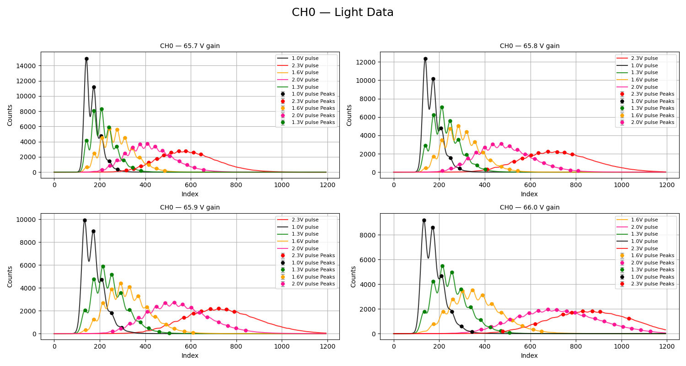
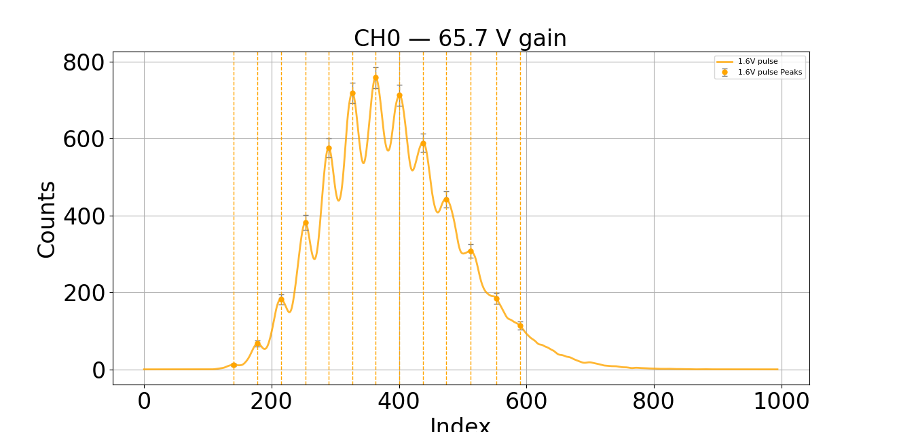
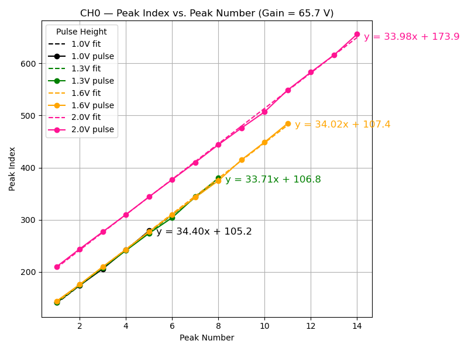
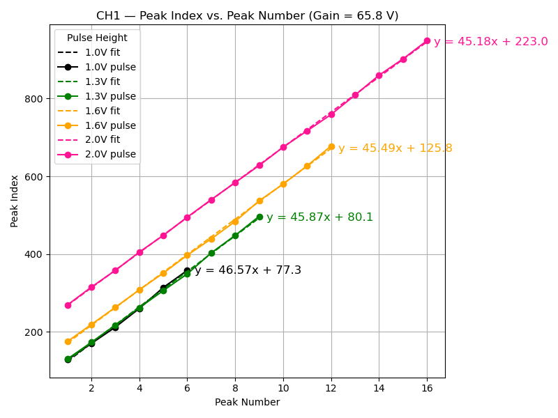

# Order of the files to be ran

## Quick and dirty
In generated new results for a new set of data
1. The main script `plot-fit-peaks-SiPM-data.py` generates the data used the other scripts 
   2. number of peaks
   3. peak index (position)
2. Run scripts in single channel analysis
3. Run `index_vs_peak.py` to generate the index vs peak data. This python file will plot the index vs peak data for each channel and save the plots in the folder "index_vs_peak_data_results". It will also save the data in a csv file in the same folder.
3. Run `spacing_vs_peak.py` to generate the spacing vs peak data. This python file will plot the spacing vs peak data for each channel and save the plots in the folder "spacing_vs_peak_data_results". It will also save the data in a csv file in the same folder.

- clear the folder that gets populated when running the main script for the other analysis scripts (slope, comparison, etc) to have just the most recent data in generated_peak_data_results
- delete results csv table
- results files get generated after each run of the main script. The folder generated_peak_data_results gets populated with the data used for the other analysis scripts (slope, comparison, etc).

###### todo - make compass folders paraced to look like my folders to be more light weight

# 1. Run the main script
The data structure was choosen to be able to loop through subdirectories in the data folder because in CoMPass, they package a single run into a project to be able to so easily drop the `runs` in a specific **drop CoMPass run folders can be simply dropped into the `data-photon-counts-SiPM` folder. (you need to change the path or take files out of each folde) **
##   Run `plot-fit-peaks-SiPM-data.py` to generate the data used in either the single-channel-analysis or coincidence-analysis subdirectories.  

- - -   
### Parcing meta data  
 
- check that the data is in the correct format to parace information out of them
      - 
      - **WARNING: COMPASS PATH DATA WAS PULLEN OUT DIRECTLY, SO YOU'D HAVE TO CHANGE THE PATH UNTIL I BUILD OUT SOMETHING TO PARCE THINGS OUT OF THOSE** :

- **_WARNING:_** If there are files in `/generated_peak_data_results` from a previous run, delete them before running the script. 
This will ensure that the new data is not mixed with old data.

###
#### For single channel measurements:  `Gain-voltage-number-decimal-represents-decimal**_gain_**Pulse-voltage-height-decimal-is-underscore_pulse_Duration-of-the-run_s` contains folders with the data
- - 
- - **_Example_:** in`data-photon-counts-SiPM` there is a folder named `20250428_more_light`
  Therewill be subdirectories inside which contain the `run` data from CoMPass. Currently for me they are:
 - - `65_7_gain_1_1_pulse_300s`
 - - `65_7_gain_1_0_pulse_300s`

- - - This means that I took two runs that day where I was changing the pulse height. The **65_7 gets parced out to be 65.7** because it's **in the back of the word gain** 
  - - The **1_1** in the directory name means I was using a pulse height voltage of **1.1** because it is **in front of the word pulse**
  - - The **300s** means I was running the experiment for **300 seconds**.
    - Some files have a `dark` written on the name, this was used in the dark measurement comparison and that gets paraced out in a very specific script `plot_light_vs_dark_counts_pulse_height_vary_gain_voltage_loop_subdirectory` in other scripts these types of files will not be seen
  - 
#### For Coincidence meassurements: `peakNUMBER-OF-PEAK-TO-COMPARE-TO_andNUMBER-OF-SECOND-PEAK-FOR-CORRELATION_correlation_window` the next part is the same file format as the single channel, but it ends with words `filtered`,`unfiltered`, and `raw`

- This means we can extract additional information of the peak numbers, correlation window, and filtered or unfiltered (or raw) to be able to sort all data coming from those folders to be in the same place
- 
  - _**Example:**_ in `data-photon-counts-SiPM` there is a folder named `20250505_coic_correlation_time_vary`and it might have a subdirectory that should look like this:`peak4_and4_50ns_correlation_window_65_7_gain_1_6_pulse_60s_filtered`  
    - `peak4_and8`: parces out to be comparing peak number 4 and correlation with the other detector peak 8
      - `4` peak comparing to
      - `8` peak checking correlation between photons
      - `50ns_correlation_window` is the correlation window I used to count when photons are considered simultaneous, denoted by being in front of those words correlation_window
      - We still get the other information using single channel analsis (voltage gain, pulse height, duration of experiment)
      - at the end of the name is `filtered` or `unfiltered` or `raw` is the type of data we are using. This allows us to make comparisons between filtered and unfiltered data
        - `filtered` means that the data was filtered to remove noise (by ComPass)
        - `unfiltered` means that the data was not filtered (by ComPass)
        - `raw` raw data from CoMPass

    
**Output**: crops, identifies peaks, and fits the curve

It produces an two images (one for CH0 and one for CH1) that looks like this: 

### **Free** parameters you can change in the code:
- **data_dir**: change the name of the name starting with a date in the data directory to look at. All data `data-photon-counts-SiPM/`, you need to specify which day's data you want to analyze
  - e.g `20250505_coic_correlation_time_vary` isa foldername you can change in there to `20250428_more_light`
- **gain_voltages_to_plot** to see only data associated with the desired gain voltages determine the number of plots and which plots are plotting for that specific gain voltage 
  - e.g if my data for example has [65.7,65.8,65.9] in its list, then changing it to [65.7,65.8] plots only data associated with that tag and same for a single [65.7]
    - obviously, this breaks when you choose something that doesnt exist, probably an exception or error will hiw
- **crop_off_start** how many values you want to crop off the start of the data
  - e.g if you want to crop off the first 100 values because the data is shifted to the right, then change it to `crop_off_start=100`
- **crop_off_end** how many values you want to crop off the end of the data
  - e.g if you want to crop off the last 2000 values that have no data in them (produces data up to 40000 and only relevant data is ~1500 in size, then change it to `crop_off_end=2000`
- **vertical_lines** boolean True or False, puts a vertical line where the calculated peaks are, it sometimes makes it easier to read the plot. For example, if turned on then all the plots will look like this:
- 
  - I set only one value of the gain to look at currently and that is its plot
- The next set of parameters determine the fitting of the data (using interpolation of the data to get the curve but will double check)
- **counts_threshold**: threshold of counts that anything below 100 will **not** be considered a peak, easy to change around when you see lower peaks not being found by peak finder
- **peak_spacing_threshold**: threshold of distance between peaks,( e.g prevent multiple points on the same peak), mine is at 16, which means the peaks have to be at least 16 indices away from each other to be considered a peak
- **sigma** this is used to make the data more smooth (is the standard deviation of the gaussian fit, this is used to determine how wide the peak is, if you want to change it to be wider or narrower, you can change this value)
- **pulse_color_map** allows you to change the specific colors of each of the pulse height curves
- **manual_peak_indices** if no matter what you do to try and get all the peaks, some won't be found because they are on a vertical hill or something like that, so you can add in peaks by analyzing the graph and putting in that index so it gets properly counted as a peak

- clear the folder that gets populated when running the main script for the other analysis scripts (slope, comparison, etc) to have just the most recent data in generated_peak_data_results
- csv updates automatically just check the date it was generated if unsure

  1a). **Description**: This python file will plot all the gain voltage subplots associated with the channel. It plots the data, fits and smoothes the data, and generates the data required for further analysis in the 'single-channel-analysis' and other subdirectories.
###  Running the dark counts script

In our initial analysis, we wanted to be able to distinguish between the peaks with no light, the "dark", and compare it to different pulse heights. There are peaks with no light because these are thermal photons that are being detected once the instrument turns on. We compared the lowest possible level

# 2.) Single Channel Analysis from generated results by step 1.

## `index_vs_peak.py`
- **Purpose**: Analyzes the relationship between index and peak values.
- **Description** By analyzing the peak index versus peak number, we are looking fow how the position of the peak (the index) changes with each peak number. A constant slope would mean that each peak moves at the same rate, so increasing the peak number doesnt change the spacing
- **Functionality**:
  - Reads a single text file containing processed data.
  - Generates a plot of index vs peak values.
  - Exports the plot and data to a CSV file for further use.

**There are no free parameters for the user to change in this script, those are set by running** `plot-fit-peaks-SiPM-data.py` **and the data this script uses comes from a folder** `generated_peak_data_results` **which is the combined peak data generated by above mentioned main script**

### This generates files that look like this:
And produces a plot for every gain and every channel (turn off interactivity if you dont want to annoying click exit on all of them)
- 

And example of how the gain and channel being changed looks like:
- 

2a). **Description**: This python file will plot the index vs peak data for each channel and save the plots in the folder 'index_vs_peak_data_results'. It will also save the data in a csv file in the same folder.

3.) Now you can run any coincidence analysis. The first file to run before running the others is 'plot_coic_addback.py'. and then you can analyze the weighted mean plot and/or the correlation window plot

# Quantum Optics Lab Data Analysis Repository

This text is red(.)
# Analysis Tools Overview

This section provides a description of the Python scripts in the `analysis-tools` directory. These scripts were primarily used for experimenting with single text files of data, allowing for quick analysis and visualization.

## Understanding the function forms of the photodiode data

The widget code was developed as a simulation tool to generate synthetic data resembling the type of experimental data you would analyze in this project. Its primary purpose was to help understand the mathematical functional forms and behaviors of the data before working with real experimental datasets.

### Purpose
- **Data Simulation**: Generates synthetic data that mimics the characteristics of experimental data, such as peaks, noise, and trends.
- **Mathematical Exploration**: Allows for testing and understanding different mathematical models and functional forms (e.g., Gaussian, Lorentzian, or polynomial fits).
- **Preliminary Analysis**: Provides a sandbox environment to test analysis scripts and workflows without relying on real experimental data.

### Functionality
1. **Synthetic Data Generation**:
   - Creates data with adjustable parameters such as peak positions, widths, amplitudes, and noise levels.
   - Simulates multiple peaks or other features to replicate experimental conditions.

2. **Interactive Widgets**:
   - Uses interactive widgets (e.g., sliders, dropdowns) to adjust parameters in real-time.
   - Allows for visualizing how changes in parameters affect the data and its analysis.

3. **Visualization**:
   - Plots the generated data, including raw data and fitted curves.
   - Provides tools to overlay different mathematical models for comparison.

4. **Testing Analysis Scripts**:
   - Outputs synthetic data in formats compatible with the analysis scripts in the repository.
   - Enables debugging and validation of scripts like `plot-fit-peaks-SiPM-data.py`, `index_vs_peak.py`, and `spacing_vs_peak.py`.

### Usage
- **Exploration**: Use the widget to experiment with different functional forms and understand their impact on the data.
- **Validation**: Test the robustness of analysis scripts by feeding them synthetic data with known properties.
- **Learning**: Gain insights into the mathematical models and their relevance to the experimental data.

### Notes
- The widget code is a standalone tool and does not directly interact with the experimental data pipeline.
- It is ideal for educational purposes and preliminary testing but should not replace real data analysis.

## `plot-fit-peaks-SiPM-data.py`
- **Purpose**: The main script for analyzing gain voltage data for a single channel.
- **Functionality**:
  - Reads a single text file containing raw data.
  - Plots the raw data for gain voltage subplots.
  - Fits and smoothes the data to identify trends.
  - Outputs processed data and plots for further analysis.
- **Usage**: Run this script to generate the foundational data required for other analysis scripts.

Global Variables and User Parameters in plot0fit-peaks-SiPM-data.py
# Quantum Optics Lab Data Analysis Repository

## Analysis Tools Overview

This section provides a description of the Python scripts in the `analysis-tools` directory. These scripts were primarily used for experimenting with single text files of data, allowing for quick analysis and visualization.

---

## Understanding the Function Forms of the Photodiode Data

The widget code was developed as a simulation tool to generate synthetic data resembling the type of experimental data you would analyze in this project. Its primary purpose was to help understand the mathematical functional forms and behaviors of the data before working with real experimental datasets.

### Purpose
- **Data Simulation**: Generates synthetic data that mimics the characteristics of experimental data, such as peaks, noise, and trends.
- **Mathematical Exploration**: Allows for testing and understanding different mathematical models and functional forms (e.g., Gaussian, Lorentzian, or polynomial fits).
- **Preliminary Analysis**: Provides a sandbox environment to test analysis scripts and workflows without relying on real experimental data.

### Functionality
1. **Synthetic Data Generation**:
   - Creates data with adjustable parameters such as peak positions, widths, amplitudes, and noise levels.
   - Simulates multiple peaks or other features to replicate experimental conditions.

2. **Interactive Widgets**:
   - Uses interactive widgets (e.g., sliders, dropdowns) to adjust parameters in real-time.
   - Allows for visualizing how changes in parameters affect the data and its analysis.

3. **Visualization**:
   - Plots the generated data, including raw data and fitted curves.
   - Provides tools to overlay different mathematical models for comparison.

4. **Testing Analysis Scripts**:
   - Outputs synthetic data in formats compatible with the analysis scripts in the repository.
   - Enables debugging and validation of scripts like `plot-fit-peaks-SiPM-data.py`, `index_vs_peak.py`, and `spacing_vs_peak.py`.

### Usage
- **Exploration**: Use the widget to experiment with different functional forms and understand their impact on the data.
- **Validation**: Test the robustness of analysis scripts by feeding them synthetic data with known properties.
- **Learning**: Gain insights into the mathematical models and their relevance to the experimental data.

### Notes
- The widget code is a standalone tool and does not directly interact with the experimental data pipeline.
- It is ideal for educational purposes and preliminary testing but should not replace real data analysis.

---

## `plot-fit-peaks-SiPM-data.py`
- **Purpose**: The main script for analyzing gain voltage data for a single channel.
- **Functionality**:
  - Reads a single text file containing raw data.
  - Plots the raw data for gain voltage subplots.
  - Fits and smoothes the data to identify trends.
  - Outputs processed data and plots for further analysis.
- **Usage**: Run this script to generate the foundational data required for other analysis scripts.

### Global Variables and User Parameters
#### General Plotting Parameters:
- `font_size`: Controls the font size for axis labels, titles, and annotations.
- `line_width`: Sets the width of the plotted lines.
- `marker_size`: Adjusts the size of markers in the plots.
- `grid_enabled`: Boolean to toggle grid lines on or off in the plots.
- `vertical_lines`: Boolean to enable or disable vertical lines for specific data points.

#### Data Processing Parameters:
- `smoothing_window`: Defines the size of the window for smoothing the data.
- `fit_model`: Specifies the mathematical model used for fitting the data (e.g., Gaussian, Lorentzian).
- `peak_threshold`: Sets the threshold for detecting peaks in the data.
- `noise_level`: Adjusts the noise level for filtering or preprocessing the data.

#### File Input/Output:
- `input_file`: Path to the input text file containing raw data.
- `output_directory`: Directory where processed data and plots are saved.
- `save_plots`: Boolean to enable or disable saving the generated plots.

#### Titles and Labels:
- `plot_title`: Title for the main plot.
- `x_axis_label`: Label for the x-axis.
- `y_axis_label`: Label for the y-axis.

#### Peak Analysis Parameters:
- `peak_prominence`: Minimum prominence of peaks to be considered in the analysis.
- `peak_distance`: Minimum distance between consecutive peaks.

---

## `index_vs_peak.py`
- **Purpose**: Analyzes the relationship between index and peak values.
- **Functionality**:
  - Reads a single text file containing processed data.
  - Generates a plot of index vs peak values.
  - Exports the plot and data to a CSV file for further use.
- **Usage**: Use this script to visualize and analyze the correlation between indices and peak values.

---

## `spacing_vs_peak.py`
- **Purpose**: Examines the spacing between peaks and their corresponding values.
- **Functionality**:
  - Reads a single text file containing processed data.
  - Creates a plot of spacing vs peak values.
  - Exports the plot and data to a CSV file for further use.
- **Usage**: Run this script to study the spacing patterns between peaks in the data.

---

## `plot_coic_addback.py`
- **Purpose**: Processes and visualizes coincidence data from a single text file.
- **Functionality**:
  - Groups data based on channel and structure (e.g., "AddBack").
  - Extracts and processes peak data, including cropping and calculating peak values, indices, and timestamps.
  - Generates plots highlighting peaks and weighted means.
  - Saves processed data and results to CSV files.
- **Usage**: Use this script to analyze coincidence data and generate visualizations.

---

## `weighted-means.py`
- **Purpose**: Visualizes weighted mean data from a single text file.
- **Functionality**:
  - Reads a CSV file containing weighted mean data.
  - Separates data into "filtered" and "unfiltered" categories.
  - Generates two plots:
    - **Filtered**: Displays weighted mean indices and times for filtered data.
    - **Unfiltered**: Displays weighted mean indices and times for unfiltered data with smart label positioning.
  - Annotates each data point for better interpretability.
- **Usage**: Run this script to visualize and compare filtered and unfiltered weighted mean data.

---

## Notes
- These scripts were designed for single-file analysis, making them ideal for quick experimentation and testing.
- Ensure the input files are properly formatted and located in the expected directories before running the scripts.

---

## Generating New Results for a New Set of Data

1. **Run the Main Script**:
   Execute the main script `plot-fit-peaks-SiPM-data.py` located in the main directory of the repository. This script processes and visualizes gain voltage data for a single channel. It performs the following tasks:
   - Plots the raw data for gain voltage subplots associated with the channel.
   - Fits and smoothes the data to identify trends.
   - Generates processed data required for further analysis in the `single-channel-analysis` and other subdirectories.
   - **Output**: Saves the processed data and plots in the `generated_peak_data_results` folder.

2. **Generate Index vs Peak Data**:
   Run `index_vs_peak.py` to analyze the relationship between index and peak values. This script:
   - Plots the index vs peak data for each channel.
   - **Output**: Saves the plots in the `index_vs_peak_data_results` folder and exports the data to a CSV file in the same folder.

3. **Generate Spacing vs Peak Data**:
   Run `spacing_vs_peak.py` to analyze the spacing between peaks and their corresponding values. This script:
   - Plots the spacing vs peak data for each channel.
   - **Output**: Saves the plots in the `spacing_vs_peak_data_results` folder and exports the data to a CSV file in the same folder.

---

## Data Analysis Workflow

- **Clear Old Data**:
  Before running the analysis scripts, ensure the `generated_peak_data_results` folder is cleared to avoid mixing old and new data.

- **Delete Outdated Results**:
  Remove outdated CSV tables and plots to maintain consistency in the analysis.

---

## Data Source and Folder Organization

### Data Source
The data used in this repository is generated from experiments conducted in the Quantum Optics Lab. Each dataset corresponds to a specific experiment and is processed using the scripts provided in this repository. The raw data files are typically stored in text or CSV format and are ingested by the scripts for analysis and visualization.

### Folder Organization
The folders in this repository are organized by date to ensure clarity and traceability of the data. Each folder is labeled with the date in the format `YYYYMMDD` (e.g., `20250507` for May 7, 2025). This structure allows for easy identification of the data associated with a specific experiment or analysis session.

### Workflow
1. **Raw Data**: Raw data files are stored in folders labeled by the date of the experiment.
2. **Processed Data**: After running the scripts, processed data and results are saved in subdirectories such as:
   - `generated_peak_data_results`: Contains processed data and plots generated by the main script.
   - `index_vs_peak_data_results`: Contains index vs peak plots and corresponding CSV files.
   - `spacing_vs_peak_data_results`: Contains spacing vs peak plots and corresponding CSV files.
3. **Output Files**: Results such as weighted means and peak summaries are saved in CSV files (e.g., `weighted_means.csv`, `peak_summary.csv`) for further analysis.

This folder structure ensures that data from different experiments is kept separate and easy to manage.

## `index_vs_peak.py`
- **Purpose**: Analyzes the relationship between index and peak values.
- **Functionality**:
  - Reads a single text file containing processed data.
  - Generates a plot of index vs peak values.
  - Exports the plot and data to a CSV file for further use.
- **Usage**: Use this script to visualize and analyze the correlation between indices and peak values.

## `spacing_vs_peak.py`
- **Purpose**: Examines the spacing between peaks and their corresponding values.
- **Functionality**:
  - Reads a single text file containing processed data.
  - Creates a plot of spacing vs peak values.
  - Exports the plot and data to a CSV file for further use.
- **Usage**: Run this script to study the spacing patterns between peaks in the data.

## `plot_coic_addback.py`
- **Purpose**: Processes and visualizes coincidence data from a single text file.
- **Functionality**:
  - Groups data based on channel and structure (e.g., "AddBack").
  - Extracts and processes peak data, including cropping and calculating peak values, indices, and timestamps.
  - Generates plots highlighting peaks and weighted means.
  - Saves processed data and results to CSV files.
- **Usage**: Use this script to analyze coincidence data and generate visualizations.

## `weighted-means.py`
- **Purpose**: Visualizes weighted mean data from a single text file.
- **Functionality**:
  - Reads a CSV file containing weighted mean data.
  - Separates data into "filtered" and "unfiltered" categories.
  - Generates two plots:
    - Filtered: Displays weighted mean indices and times for filtered data.
    - Unfiltered: Displays weighted mean indices and times for unfiltered data with smart label positioning.
  - Annotates each data point for better interpretability.
- **Usage**: Run this script to visualize and compare filtered and unfiltered weighted mean data.

## Notes
- These scripts were designed for single-file analysis, making them ideal for quick experimentation and testing.
- Ensure the input files are properly formatted and located in the expected directories before running the scripts.

## Generating New Results for a New Set of Data

1. **Run the Main Script**:  
   Execute the main script `plot-fit-peaks-SiPM-data.py` located in the main directory of the repository. This script processes and visualizes gain voltage data for a single channel. It performs the following tasks:
   - Plots the raw data for gain voltage subplots associated with the channel.
   - Fits and smoothes the data to identify trends.
   - Generates processed data required for further analysis in the `single-channel-analysis` and other subdirectories.
   - **Output**: Saves the processed data and plots in the `generated_peak_data_results` folder.

2. **Generate Index vs Peak Data**:  
   Run `index_vs_peak.py` to analyze the relationship between index and peak values. This script:
   - Plots the index vs peak data for each channel.
   - **Output**: Saves the plots in the `index_vs_peak_data_results` folder and exports the data to a CSV file in the same folder.

3. **Generate Spacing vs Peak Data**:  
   Run `spacing_vs_peak.py` to analyze the spacing between peaks and their corresponding values. This script:
   - Plots the spacing vs peak data for each channel.
   - **Output**: Saves the plots in the `spacing_vs_peak_data_results` folder and exports the data to a CSV file in the same folder.

## Data Analysis Workflow

- **Clear Old Data**:  
  Before running the analysis scripts, ensure the `generated_peak_data_results` folder is cleared to avoid mixing old and new data.
  
- **Delete Outdated Results**:  
  Remove outdated CSV tables and plots to maintain consistency in the analysis.

## Single Channel Analysis Plots

This section describes the scripts used for analyzing and visualizing data in the single-channel analysis workflow.

### `plot0fit-peaks-SiPM-data.py`
- **Purpose**: The primary tool for analyzing gain voltage data for a single channel.
- **Functionality**:
  - Visualizes raw data for gain voltage subplots.
  - Fits and smoothes the data to identify trends.
  - Saves processed data and plots for further analysis.
- **Output Location**: `generated_peak_data_results` folder.

### `index_vs_peak.py`
- **Purpose**: Generates plots for the relationship between index and peak values.
- **Functionality**:
  - Creates index vs peak plots for each channel.
  - Exports the data to a CSV file.
- **Output Location**: `index_vs_peak_data_results` folder.

### `spacing_vs_peak.py`
- **Purpose**: Analyzes the spacing between peaks and their corresponding values.
- **Functionality**:
  - Creates spacing vs peak plots for each channel.
  - Exports the data to a CSV file.
- **Output Location**: `spacing_vs_peak_data_results` folder.

## Coincidence Analysis Scripts

This directory contains Python scripts for analyzing and visualizing coincidence data from peak detection experiments.

### `plot_coic_addback.py`
- **Purpose**: Processes and visualizes coincidence data from text files.
- **Functionality**:
  - Groups input files based on channel and structure (e.g., "AddBack").
  - Extracts and processes peak data, including cropping and calculating peak values, indices, and timestamps.
  - Computes the weighted mean index and time for each dataset.
  - Generates plots for each group, highlighting peaks and weighted means.
  - Saves sorted peak data and weighted mean results to CSV files.
- **Output Location**: `peak_summary.csv` and `weighted_means.csv`.

### `weighted-means.py`
- **Purpose**: Visualizes the weighted mean data generated by `plot_coic_addback.py`.
- **Functionality**:
  - Reads the `weighted_means.csv` file.
  - Separates data into "filtered" and "unfiltered" categories for analysis.
  - Creates two plots:
    - **Filtered Plot**: Displays weighted mean indices and times for filtered data.
    - **Unfiltered Plot**: Displays weighted mean indices and times for unfiltered data with smart label positioning.
  - Annotates each data point with its weighted mean time.
- **Output Location**: Plots are displayed and can be saved manually.

## Notes
- Always ensure the relevant folders (`generated_peak_data_results`, `index_vs_peak_data_results`, `spacing_vs_peak_data_results`) are cleared before running the scripts to avoid mixing old and new data.
- Delete outdated results CSV tables to maintain consistency in the analysis.

## Data Source and Folder Organization

### Data Source
The data used in this repository is generated from experiments conducted in the Quantum Optics Lab. Each dataset corresponds to a specific experiment and is processed using the scripts provided in this repository. The raw data files are typically stored in text or CSV format and are ingested by the scripts for analysis and visualization.

### Folder Organization
The folders in this repository are organized by date to ensure clarity and traceability of the data. Each folder is labeled with the date in the format `YYYYMMDD` (e.g., `20250507` for May 7, 2025). This structure allows for easy identification of the data associated with a specific experiment or analysis session.

### Workflow
1. **Raw Data**: Raw data files are stored in folders labeled by the date of the experiment.
2. **Processed Data**: After running the scripts, processed data and results are saved in subdirectories such as:
   - `generated_peak_data_results`: Contains processed data and plots generated by the main script.
   - `index_vs_peak_data_results`: Contains index vs peak plots and corresponding CSV files.
   - `spacing_vs_peak_data_results`: Contains spacing vs peak plots and corresponding CSV files.
3. **Output Files**: Results such as weighted means and peak summaries are saved in CSV files (e.g., `weighted_means.csv`, `peak_summary.csv`) for further analysis.

This folder structure ensures that data from different experiments is kept separate and easy to manage.

# duplicate 

b
In generated new results for a new set of data
1. The main script `plot-fit-peaks-SiPM-data.py` generates the data used the other scripts 
   2. number of peaks
   3. peak index (position)
2. Run `index_vs_peak.py` to generate the index vs peak data. This python file will plot the index vs peak data for each channel and save the plots in the folder "index_vs_peak_data_results". It will also save the data in a csv file in the same folder.
3. Run `spacing_vs_peak.py` to generate the spacing vs peak data. This python file will plot the spacing vs peak data for each channel and save the plots in the folder "spacing_vs_peak_data_results". It will also save the data in a csv file in the same folder.

# Data analysis
- clear the folder that gets populated when running the main script for the other analysis scripts (slope, comparison, etc) to have just the most recent data in generated_peak_data_results
- delete results csv table
- results files get generated after each run of the main script. The folder generated_peak_data_results gets populated with the data used for the other analysis scripts (slope, comparison, etc).

# Single Channel Analysis Plots

This section describes the scripts used for analyzing and visualizing data in the single-channel analysis workflow. Each script processes specific aspects of the data and generates corresponding plots.
# quantum_optics_lab_job

In generating new results for a new set of data:

1. Run the main script `plot0fit-peaks-SiPM-data.py` located in the main directory of the repository. This script processes and visualizes gain voltage data for a single channel. It plots the data, fits and smoothes the data, and generates the data required for further analysis in the `single-channel-analysis` and other subdirectories.
2. Run `index_vs_peak.py` to generate the index vs peak data. This Python file will plot the index vs peak data for each channel and save the plots in the folder `index_vs_peak_data_results`. It will also save the data in a CSV file in the same folder.
3. Run `spacing_vs_peak.py` to generate the spacing vs peak data. This Python file will plot the spacing vs peak data for each channel and save the plots in the folder `spacing_vs_peak_data_results`. It will also save the data in a CSV file in the same folder.

# Data Analysis

- Clear the folder `generated_peak_data_results` that gets populated when running the main script to ensure only the most recent data is used for the other analysis scripts (e.g., slope, comparison, etc.).
- Delete outdated results CSV tables to maintain consistency in the analysis.

# Single Channel Analysis Plots

This section describes the scripts used for analyzing and visualizing data in the single-channel analysis workflow. Each script processes specific aspects of the data and generates corresponding plots.

## `plot-fit-peaks-SiPM-data.py`
This script is the primary tool for analyzing gain voltage data for a single channel. It performs the following tasks:
- **Data Plotting**: Visualizes the raw data for gain voltage subplots associated with the channel.
- **Data Fitting**: Fits the data using appropriate models to identify key trends.
- **Data Smoothing**: Applies smoothing techniques to enhance the clarity of the plots.
- **Output**: Saves the generated plots and processed data for further analysis in the `single-channel-analysis` and other subdirectories.

## `index_vs_peak.py`
This script generates plots for the relationship between index and peak values for a single channel. It includes:
- **Data Plotting**: Creates plots showing the index vs peak data for each channel.
- **Data Export**: Saves the plots in the `index_vs_peak_data_results` folder and exports the data to a CSV file in the same folder.

## `spacing_vs_peak.py`
This script analyzes the spacing between peaks and their corresponding values. It performs the following:
- **Data Plotting**: Generates spacing vs peak plots for each channel.
- **Data Export**: Saves the plots in the `spacing_vs_peak_data_results` folder and exports the data to a CSV file in the same folder.

## Notes
- Ensure the folder `generated_peak_data_results` is cleared before running the scripts to avoid mixing old and new data.
- Delete any outdated results CSV tables to maintain consistency in the analysis.
## `index_vs_peak.py`
This script generates plots for the relationship between index and peak values for a single channel. It includes:
- **Data Plotting**: Creates plots showing the index vs. peak data for each channel.
- **Data Export**: Saves the plots in the `index_vs_peak_data_results` folder and exports the data to a CSV file in the same folder.

## `spacing_vs_peak.py`
This script analyzes the spacing between peaks and their corresponding values. It performs the following:
- **Data Plotting**: Generates spacing vs. peak plots for each channel.
- **Data Export**: Saves the plots in the `spacing_vs_peak_data_results` folder and exports the data to a CSV file in the same folder.

## Notes
- Ensure the folder `generated_peak_data_results` is cleared before running the scripts to avoid mixing old and new data.
- Delete any outdated results CSV tables to maintain consistency in the analysis.

# Coincidence Analysis Scripts

This directory contains Python scripts for analyzing and visualizing coincidence data from peak detection experiments. Below is an overview of each script and its functionality:

## `plot_coic_addback.py`
This script processes and visualizes coincidence data from text files. It performs the following tasks:
- **File Grouping**: Groups input files based on channel and structure (e.g., "AddBack").
- **Data Processing**: Extracts and processes peak data, including cropping and calculating peak values, indices, and timestamps.
- **Weighted Mean Calculation**: Computes the weighted mean index and time for each dataset.
- **Plotting**: Generates plots for each group, highlighting peaks and weighted means. The plots are sorted and annotated for clarity.
- **Data Export**: Saves sorted peak data and weighted mean results to CSV files (`peak_summary.csv` and `weighted_means.csv`).

## `weighted-means.py`
This script visualizes the weighted mean data generated by `plot_coic_addback.py`. It includes:
- **Data Loading**: Reads the `weighted_means.csv` file.
- **Filtered and Unfiltered Data Separation**: Splits the data into "filtered" and "unfiltered" categories for separate analysis.
- **Visualization**: Creates two plots:
  - **Filtered Plot**: Displays weighted mean indices and times for filtered data.
  - **Unfiltered Plot**: Displays weighted mean indices and times for unfiltered data, with smart label positioning to avoid overlap.
- **Annotation**: Annotates each data point with its weighted mean time for better interpretability.